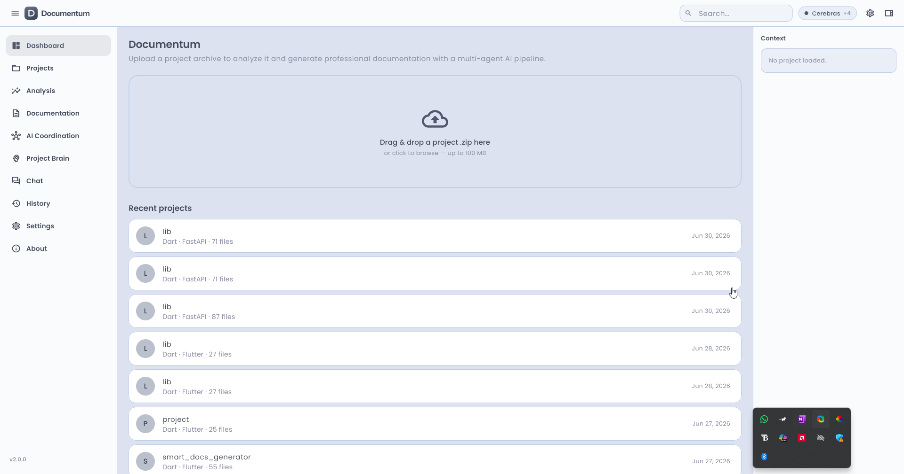
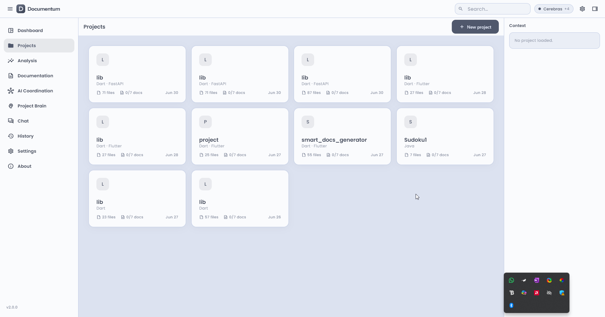
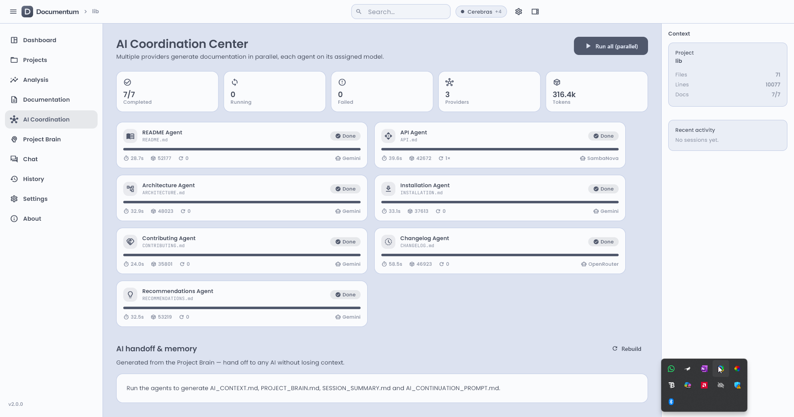
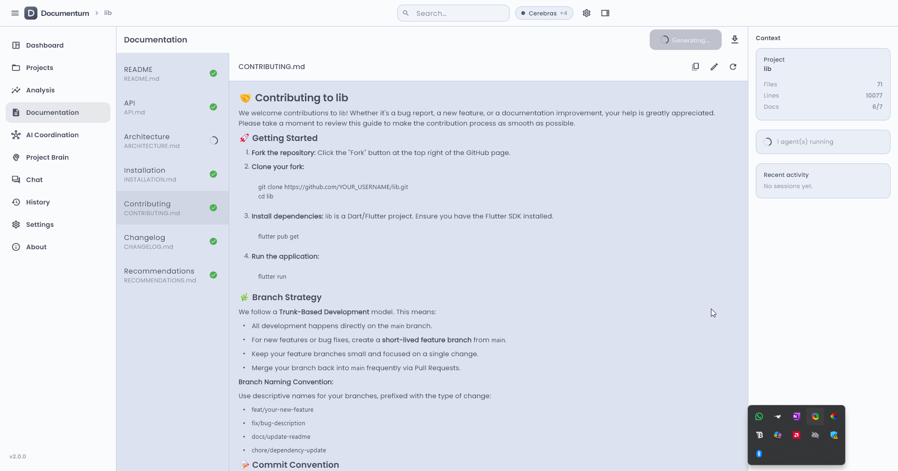
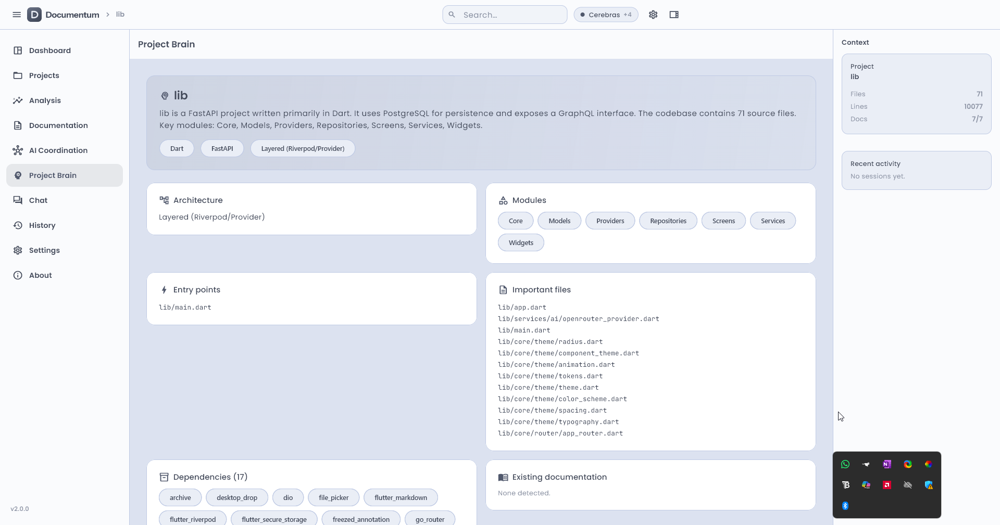
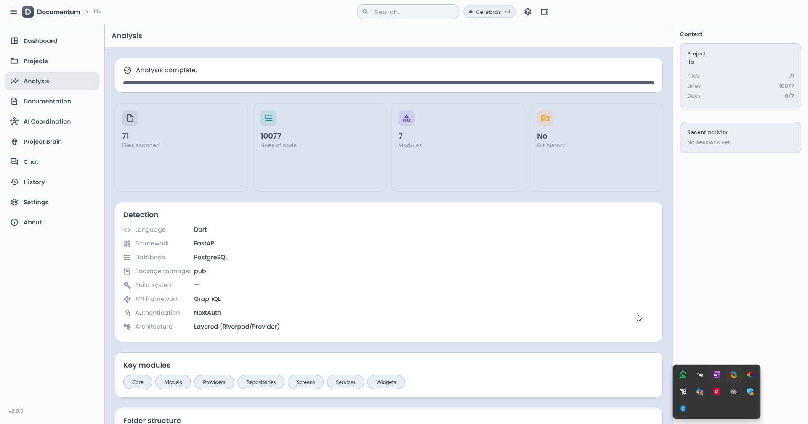
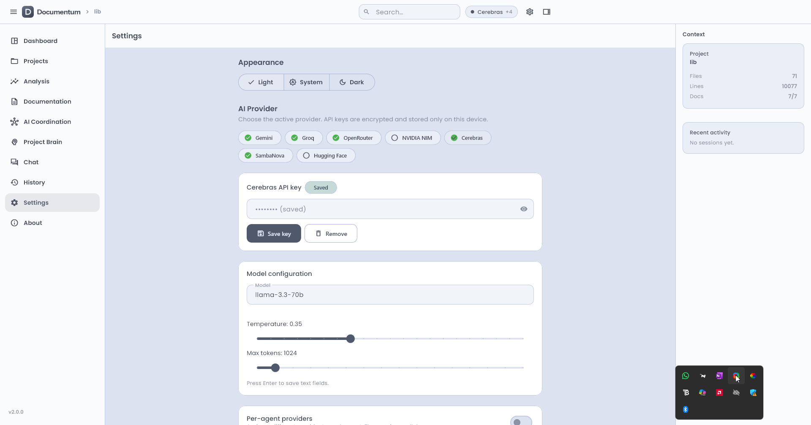
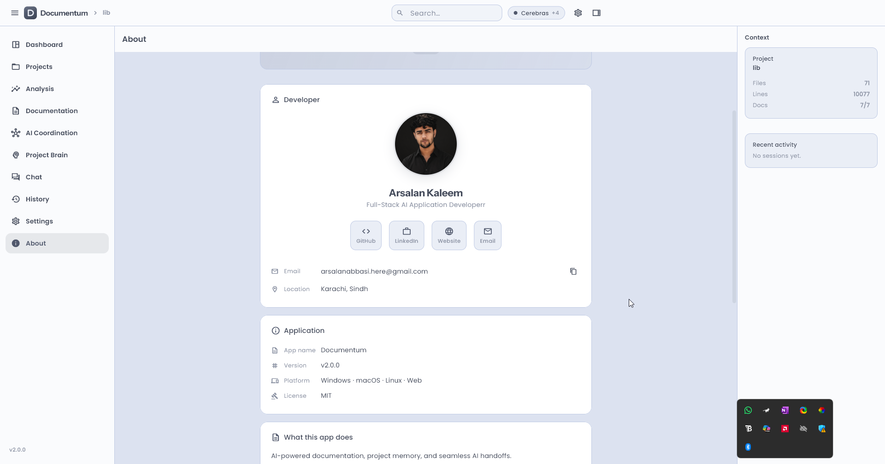

# Documentum

> **AI-powered documentation, project memory, and seamless AI handoffs — for any codebase, on any platform.**

            <a href="https://documentum-app.web.app"></a>   <a href="https://github.com/ArsalanKaleem/Documentum/releases/latest"></a> </p> <p align="center">   <a href="https://documentum-app.web.app"><b>🌐 Live Web Demo</b></a> ·   <a href="#-download-for-windows"><b>⬇️ Download for Windows</b></a> ·   <a href="#-features"><b>✨ Features</b></a> ·   <a href="#-getting-started"><b>🚀 Getting Started</b></a> ·   <a href="#-documentation"><b>📄 Docs    </b></a> </p>

## 📖 Overview

**Documentum** is a cross-platform Flutter application — available on **Windows desktop** and **Web** — that analyzes any codebase and generates production-ready, professional documentation automatically. Point it at a project, and a coordinated team of AI agents produces a complete documentation suite: README, API reference, architecture guide, installation instructions, contributing guidelines, changelog, and smart recommendations.

Unlike single-shot "summarize my repo" tools, Documentum builds a persistent **Project Brain** — a semantic memory of your codebase — so you can keep asking questions, regenerate docs as the project evolves, and hand off full project context to any external AI tool in one export.

It's also fully **AI-provider agnostic**: bring your own free-tier API key from any of seven supported providers, mix and match models per agent, and never get locked into a single vendor.

---

## ⬇️ Download for Windows

The easiest way to get started on Windows is to download the latest installer from the **Releases** page — no Flutter SDK or build tooling required.

<p align="center">   <a href="https://github.com/ArsalanKaleem/Documentum/releases/latest">        </a> </p> 1. Go to the **[Releases page](https://github.com/ArsalanKaleem/Documentum/releases/latest)**.
1. Under **Assets**, download the latest `Documentum-Setup.exe`.
1. Run the installer and follow the setup wizard.
1. Launch Documentum from the Start Menu, open **Settings → AI Providers**, and add at least one free API key.

> **System requirements:** Windows 10 (64-bit) or later. **Note:** Windows SmartScreen may warn about an unrecognized publisher on first run, since the installer isn't code-signed yet — click **More info → Run anyway** to proceed.

Prefer not to install anything? Use the **[Live Web Demo](https://documentum-app.web.app/)** instead — it runs the full app directly in your browser.

---

## ✨ Features


| Feature                         | Description                                                                                                                                                                                             |
| ------------------------------- | ------------------------------------------------------------------------------------------------------------------------------------------------------------------------------------------------------- |
| **Multi-Agent Documentation**   | Seven parallel AI agents each produce a dedicated document — README, API, Architecture, Installation, Contributing, Changelog, and Recommendations — generated concurrently rather than sequentially. |
| **AI Provider Agnostic**        | Plug in any of seven free-tier providers: Gemini, Groq, OpenRouter, NVIDIA NIM, Cerebras, SambaNova, or Hugging Face. No vendor lock-in, no paid API required to get started.                           |
| **Per-Agent Provider Routing**  | Assign a different model to each agent — for example, run the Architecture agent on Gemini while the Changelog agent runs on Groq, optimizing for speed, quality, or rate limits per task.             |
| **Project Brain**               | A persistent, semantic memory of your project that powers context-aware chat and keeps documentation grounded in the actual codebase, not just a snapshot.                                              |
| **AI Chat**                     | Ask anything about your codebase through a built-in streaming chat interface, backed by the Project Brain's vector index.                                                                               |
| **Automatic Project Analysis**  | Detects language, framework, database, authentication system, build system, and architecture pattern without any manual configuration.                                                                  |
| **AI Coordination Dashboard**   | A live visual dashboard of all running agents, with real-time status, progress, and automatic retry tracking on failure.                                                                                |
| **Full History**                | Every generation session is logged with timestamps and a complete snapshot of the documents produced, so you can compare versions over time.                                                            |
| **Context File Export**         | Export the full project context as a single structured file, ready to paste into any external AI tool or LLM chat session.                                                                              |
| **Semantic Embeddings**         | Vector-based project indexing (via Gemini's`text-embedding-004`) powers smarter, more relevant chat responses.                                                                                          |
| **Dark / Light / System Theme** | Full Material You theming with per-component overrides, so the app matches your OS preference out of the box.                                                                                           |
| **Cross-Platform**              | Native Windows desktop build and a full-featured web app, sharing a single Flutter codebase.                                                                                                            |

---

## 🖼️ Screenshots


| Dashboard                               | Projects                              |
| --------------------------------------- | ------------------------------------- |
|  |  |


| AI Coordination                                | Documentation                                    |
| ---------------------------------------------- | ------------------------------------------------ |
|  |  |


| Project Brain                                  | Analysis                              |
| ---------------------------------------------- | ------------------------------------- |
|  |  |


| Settings                              | About                           |
| ------------------------------------- | ------------------------------- |
|  |  |

---

## 🏗️ Architecture

Documentum follows a clean, layered architecture built around Riverpod state management and a provider-agnostic AI service layer.

```
lib/
├── app.dart                    # App root (MaterialApp.router)
├── main.dart                   # Entry point
├── core/
│   ├── constants/              # App-wide compile-time constants
│   ├── errors/                 # Failure types
│   ├── router/                 # go_router configuration & destinations
│   ├── theme/                  # Color scheme, typography, component themes, tokens
│   └── utils/                  # Cancellation tokens, path safety
├── models/                     # Freezed data models (+ generated .freezed/.g files)
├── providers/                  # Riverpod providers (settings, chat, docs, projects…)
├── repositories/               # Settings & project persistence
├── screens/
│   ├── about/
│   ├── analysis/
│   ├── brain/
│   ├── chat/
│   ├── coordination/
│   ├── dashboard/
│   ├── documentation/
│   ├── history/
│   ├── projects/
│   └── settings/
├── services/
│   ├── ai/                     # Provider implementations (Gemini, Groq, OpenRouter…)
│   ├── embeddings/             # Embedding service
│   ├── export/                 # Context file & document export
│   ├── orchestrator/           # Multi-agent pipeline + prompt builders
│   │   └── agents/             # DocAgent, ReadmeAgent, ApiAgent, ArchitectureAgent…
│   ├── file_scanner_service.dart
│   ├── project_analyzer_service.dart
│   ├── project_brain_service.dart
│   ├── session_tracker_service.dart
│   └── zip_service.dart
└── widgets/                    # Shared widgets (AppShell, UploadArea, MarkdownView…)
```

**State management:** Riverpod (`AsyncNotifierProvider`, `StateNotifierProvider`) **Navigation:** go\_router with `StatefulShellRoute` (indexed stack) **Models:** Freezed + json\_serializable **AI layer:** Provider-agnostic `AiProvider` interface, with concrete adapters per service **Deployment:** Firebase Hosting (web) with GitHub Actions CI/CD; Windows builds packaged via Inno Setup

See [`ARCHITECTURE.md`](https://claude.ai/chat/ARCHITECTURE.md) for a full deep-dive, including data flow diagrams and the multi-agent orchestration pipeline.

---

## 🚀 Getting Started

### Option 1 — Download the Windows installer (recommended)

See [Download for Windows]() above. No development environment required.

### Option 2 — Use the Web app

Just open **[documentum-app.web.app](https://documentum-app.web.app/)** — nothing to install.

### Option 3 — Build from source

See [`INSTALLATION.md`](https://claude.ai/chat/INSTALLATION.md) for full, platform-by-platform setup instructions.

**Quick start:**

```bash
git clone https://github.com/ArsalanKaleem/documentum.git
cd documentum
flutter pub get
dart run build_runner build --delete-conflicting-outputs
flutter run -d windows   # or macos, linux, chrome
```

Then open **Settings → AI Providers** and add at least one free API key.

---

## 🤖 Supported AI Providers

All providers listed below have a **free tier** with no credit card required.


| Provider         | Free Models                              | Sign Up                                             |
| ---------------- | ---------------------------------------- | --------------------------------------------------- |
| **Gemini**       | `gemini-2.5-flash`,`text-embedding-004`  | [aistudio.google.com](https://aistudio.google.com/) |
| **Groq**         | `llama-3.3-70b`(and others)              | [console.groq.com](https://console.groq.com/)       |
| **OpenRouter**   | `deepseek/deepseek-r1:free`+ many others | [openrouter.ai](https://openrouter.ai/)             |
| **NVIDIA NIM**   | `meta/llama-3.3-70b-instruct`            | [build.nvidia.com](https://build.nvidia.com/)       |
| **Cerebras**     | `llama-3.3-70b`                          | [cloud.cerebras.ai](https://cloud.cerebras.ai/)     |
| **SambaNova**    | `Meta-Llama-3.3-70B-Instruct`            | [cloud.sambanova.ai](https://cloud.sambanova.ai/)   |
| **Hugging Face** | `meta-llama/Llama-3.3-70B-Instruct`      | [huggingface.co](https://huggingface.co/)           |

Because each of the seven documentation agents can be routed to a different provider, you can balance speed, quality, and free-tier rate limits across an entire generation run.

---

## 🧠 How It Works

1. **Load a project** — point Documentum at a local folder or upload a zipped codebase.
2. **Automatic analysis** — the `project_analyzer_service` detects your stack: language, framework, database, auth system, build tooling, and architecture pattern.
3. **Project Brain indexing** — the codebase is chunked and embedded into a semantic vector index, forming the Project Brain.
4. **Multi-agent generation** — seven agents (README, API, Architecture, Installation, Contributing, Changelog, Recommendations) run in parallel, each grounded in the Project Brain and routed to your chosen AI provider.
5. **Review & iterate** — inspect generated docs, chat with the Project Brain for clarifications, and regenerate individual documents as your codebase changes.
6. **Export** — download finished documentation, or export a structured context file for use in any external AI tool.

---

## 📄 Documentation

* [`INSTALLATION.md`](INSTALLATION.md) — Detailed setup for Windows, macOS, Linux, and Web
* [`ARCHITECTURE.md`](ARCHITECTURE.md) — System design, data flow, and component breakdown
* [`API.md`](API.md) — Internal API contracts (AI provider interface, models, services)
* [`CONTRIBUTING.md`](CONTRIBUTING.md) — How to contribute
* [`CHANGELOG.md`](CHANGELOG.md) — Version history
* [`SECURITY.md`](SECURITY.md) — About Security

---

## 🗺️ Roadmap

* [ ]  macOS and Linux installer packages
* [ ]  Additional export formats (Notion, Confluence, PDF bundle)
* [ ]  Team/shared Project Brain sync
* [ ]  Custom agent templates and prompt overrides
* [ ]  Code-signed Windows installer

Have a feature request? Open an [issue](https://github.com/ArsalanKaleem/Documentum/issues) or start a discussion.

---

## 🤝 Contributing

Contributions are welcome! Please read [`CONTRIBUTING.md`](CONTRIBUTING.md) for guidelines on submitting issues and pull requests, coding conventions, and the project's development workflow.

---

## 📜 License

Distributed under the MIT License. See [`LICENSE`](LICENSE) for full details.

---

## 👤 Author

**Arsalan Kaleem ** Flutter & AI Developer

[](https://github.com/ArsalanKaleem)

---

<p align="center">   If Documentum saves you time, consider giving the repo a ⭐ — it helps others find the project. </p>
